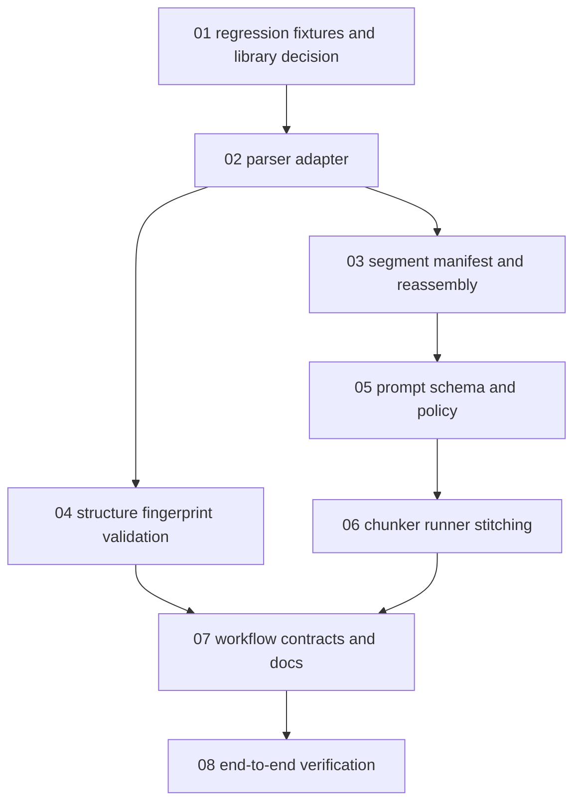

# Task 19U: Segment-Based Markdown Translation Reassembly Implementation Plan

> **For agentic workers:** REQUIRED SUB-SKILL: Use superpowers:subagent-driven-development (recommended) or superpowers:executing-plans to implement this plan task-by-task. Steps use checkbox (`- [ ]`) syntax for tracking.

**Goal:** Replace the fragile full-scratch Markdown translation path with parser-backed text segment translation and deterministic Markdown reassembly.

**Architecture:** This file is the orchestration index only. Domain work is split into small subtask plans so each worker can load one focused contract, implement that domain, run its verification slice, and hand off concrete artifacts to the next worker. The backend will parse source Markdown, extract only translatable text segments with source ranges, ask Codex for `{ id, translated_text }`, splice translated text back into the original Markdown, and validate preserved structure with parser-backed fingerprints.

**Tech Stack:** TypeScript, Bun, Vitest, existing `markdown-it` renderer, `unified`, `remark-parse`, `remark-gfm`, `remark-math`, `unist-util-visit-parents`, mdast/unist position offsets, optional narrow `micromark` fallback, existing Codex app-server client, SQLite translation job/chunk tables.

---

## Execution Model

Task 19U is intentionally decomposed. Do not ask a single worker to carry the entire Markdown parser, prompt schema, runner, docs, and E2E context at once.

Execution status: complete. All domain subtasks below have been executed and
verified against the commands listed in this workflow.

Each subtask owns one domain:

- A clear role.
- A small file surface.
- A focused test command.
- A concrete handoff contract for downstream subtasks.

Subagents should be assigned one subtask file at a time. The parent worker reviews each handoff before starting dependent subtasks.

## Subtask Index

1. [Regression fixtures and library decision](task-19-codex-translation-segment-reassembly/01-regression-fixtures-and-library-decision.md)
2. [Parser adapter](task-19-codex-translation-segment-reassembly/02-parser-adapter.md)
3. [Segment manifest and reassembly](task-19-codex-translation-segment-reassembly/03-segment-manifest-and-reassembly.md)
4. [Structure fingerprint validation](task-19-codex-translation-segment-reassembly/04-structure-fingerprint-validation.md)
5. [Prompt schema and policy](task-19-codex-translation-segment-reassembly/05-prompt-schema-and-policy.md)
6. [Chunker, runner, and stitching integration](task-19-codex-translation-segment-reassembly/06-chunker-runner-and-stitching.md)
7. [Workflow contracts and docs cleanup](task-19-codex-translation-segment-reassembly/07-workflow-contracts-and-docs.md)
8. [End-to-end verification](task-19-codex-translation-segment-reassembly/08-end-to-end-verification.md)

## Dependency Graph

## Parallelization Rules

- `01` must run first.
- `02` runs after `01`.
- `03` and `04` can run in parallel after `02`.
- `05` depends on `03`.
- `06` depends on `05`.
- `07` can begin after `05`, but must be finalized after `06`.
- `08` runs last.

## Cross-Cutting Constraints

- Do not continue expanding the regex scanner to cover all Markdown.
- Do not use a Markdown stringifier for production output.
- Do not introduce `tree-sitter-markdown` for this task.
- Keep `markdown-it` as the Reader renderer, not the segment extraction source of truth.
- Use `micromark` only as a narrow token-offset fallback when mdast positions cannot represent a required source range.
- Preserve existing storage, auth, app-server transport, frontend controls, and backup behavior unless a subtask explicitly says otherwise.
- Completed translated output remains a normal `CONTENT.md` variant under `memories/<memory_id>/<lang_code>/CONTENT.md`.
- Temporary translated chunk bodies remain temporary SQLite data and are still purged after final commit.
- `BRILLIANT_PROMPT_POLICY_VERSION` must move to a new monotonic segment policy such as `brilliant-segments-v1`.

## Final Acceptance Criteria

- Codex no longer receives instructions to emit full translated Markdown for the primary path.
- Codex returns only segment ids and translated text.
- Original Markdown syntax is preserved by deterministic source splicing.
- Link destinations, image destinations, code, inline code, math, HTML, footnote labels, table shape, and frontmatter are preserved without relying on model behavior.
- The scratch regex scanner is not the source of truth for Markdown dialect coverage.
- Focused translation tests, typecheck, whitespace checks, and full verification pass or document a confirmed unrelated existing flake.
