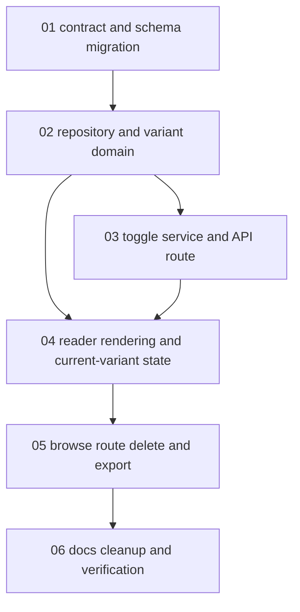

# Task 19W: Variant-Local Flashbacks Implementation Plan

> **For agentic workers:** REQUIRED SUB-SKILL: Use superpowers:subagent-driven-development (recommended) or superpowers:executing-plans to implement this plan task-by-task. Steps use checkbox (`- [ ]`) syntax for tracking.

**Goal:** Make Flashbacks work independently on source and translated reader variants while keeping `/flashbacks`, memory browse, and search as one unified Flashback surface.

**Architecture:** Keep a single `flashbacks` table and add variant identity to each row. A source Flashback stores source reader offsets; a translated Flashback stores translated reader offsets scoped to the current translation output hash. Reader routes render only the active variant's rows, while global browse routes union all renderable source and translated rows.

**Tech Stack:** TypeScript, Bun, Vitest, Drizzle SQLite migrations, SolidStart API routes, existing reader selection logic, existing Flashback range merge/split logic, existing translation current-state resolver.

---

## Status

Task 19W supersedes the Flashback portion of Task 19V.

Task 19V tried to keep Flashbacks source-canonical and project translated selections through `translation_projection_spans`. That design is too coarse for arbitrary phrase selection across languages and makes normal translated Flashback creation fail. Task 19W removes Flashback projection from the write path and treats Flashbacks as local to the reader variant where they were created.

Moment projection is not part of this workflow. Do not change Moment behavior unless a later workflow explicitly scopes that work.

## Execution Model

This workflow is intentionally decomposed. Do not assign all schema, repository, reader, browse, backup, and docs changes to one worker.

Each subtask owns one domain:

- A bounded file surface.
- Focused red tests before implementation.
- A local verification command.
- A handoff contract for the next worker.

The parent worker reviews each subtask handoff before starting dependent subtasks.

## Product Contract

- A Flashback created on `/memories/:id` belongs to the source variant.
- A Flashback created on `/memories/:langCode/:id` belongs to that translated variant.
- Source and translated Flashbacks for the same memory are independent rows and independent ranges.
- Translated Flashback rows are scoped to the translation `outputHash` that produced the visible translated `CONTENT.md`.
- Re-translation changes `outputHash`; translated Flashbacks from older output hashes are hidden from reader and browse surfaces.
- `/flashbacks`, memory browse, search, and right-rail "All" views include renderable Flashbacks from both source and translated variants.
- Source reader routes render source Flashbacks only.
- Translated reader routes render translated Flashbacks for the current `langCode + outputHash` only.
- Translated Flashback writes must not mutate source Flashback rows.
- Flashback validation remains structural: resolve the selected text against the active variant's Markdown, preserve range merge/split behavior, reject stale content hashes, and do not guess a placement.

## Data Model Decision

Use one variant-aware table instead of introducing `translated_flashbacks`.

This preserves the product model that Flashbacks are one concept, one global list, one search dimension, and one deletion interaction. The variant columns determine where a row is valid:

```ts
export type FlashbackVariant =
  | { kind: "source" }
  | {
      kind: "translation";
      langCode: SupportedLanguageCode;
      outputHash: string;
    };
```

Database columns:

```sql
variant_kind text not null default 'source'
lang_code text
translation_output_hash text
```

Rules:

- `variant_kind = 'source'` requires `lang_code is null` and `translation_output_hash is null`.
- `variant_kind = 'translation'` requires a supported `lang_code` and a `translation_output_hash` matching `sha256:*`.
- `content_hash` still hashes the active variant's reader text.

## Subtask Index

1. [Contract and schema migration](task-19-codex-translation-variant-local-flashbacks/01-contract-and-schema-migration.md)
2. [Repository and variant domain](task-19-codex-translation-variant-local-flashbacks/02-repository-and-variant-domain.md)
3. [Toggle service and API route](task-19-codex-translation-variant-local-flashbacks/03-toggle-service-and-api-route.md)
4. [Reader rendering and current-variant state](task-19-codex-translation-variant-local-flashbacks/04-reader-rendering-and-current-variant-state.md)
5. [Browse, Flashbacks route, deletion, and export](task-19-codex-translation-variant-local-flashbacks/05-browse-route-delete-and-export.md)
6. [Docs cleanup and verification](task-19-codex-translation-variant-local-flashbacks/06-docs-cleanup-and-verification.md)

## Dependency Graph



## Parallelization Rules

- `01` must run first.
- `02` depends on `01`.
- `03` and `04` both depend on `02`; `04` must be finalized after `03` because reader state consumes API response shape.
- `05` depends on `03` and `04`.
- `06` runs last.

## Cross-Cutting Constraints

- Do not create a second Flashback table.
- Do not project translated Flashback selections back to source.
- Do not render source Flashbacks on translated routes.
- Do not render translated Flashbacks on source routes.
- Do not render translated Flashbacks when `translation_output_hash` differs from the current translation `outputHash`.
- Do not mutate `CONTENT.md` for normal Flashback persistence.
- Do not remove existing range merge/split behavior.
- Do not change Moment behavior in this workflow.
- Do not remove `translation_projection_spans`; it remains translation runtime data outside Flashback writes.
- Keep SQLite as runtime source of truth and JSON files as backup/export artifacts.

## Final Acceptance Criteria

- Existing source Flashbacks migrate to `variant_kind = 'source'`.
- Translated reader selection creates a translated Flashback row without requiring projection spans.
- Source and translated Flashbacks for the same memory can coexist without replacing each other.
- Source reader renders only source rows.
- Translated reader renders only rows for the active `langCode + outputHash`.
- `/flashbacks` includes renderable source and translated rows.
- Global Flashback links navigate to the correct source or translated reader route.
- Deleting a translated Flashback removes only the translated row.
- Translated Flashback backup/export writes `memories/<memoryId>/<langCode>/FLASHBACKS.json`.
- Architecture and Task 19 docs no longer claim Flashbacks are source-canonical across translated readers.
- Focused tests, typecheck, `git diff --check`, and full verification pass or document a confirmed unrelated existing flake.
