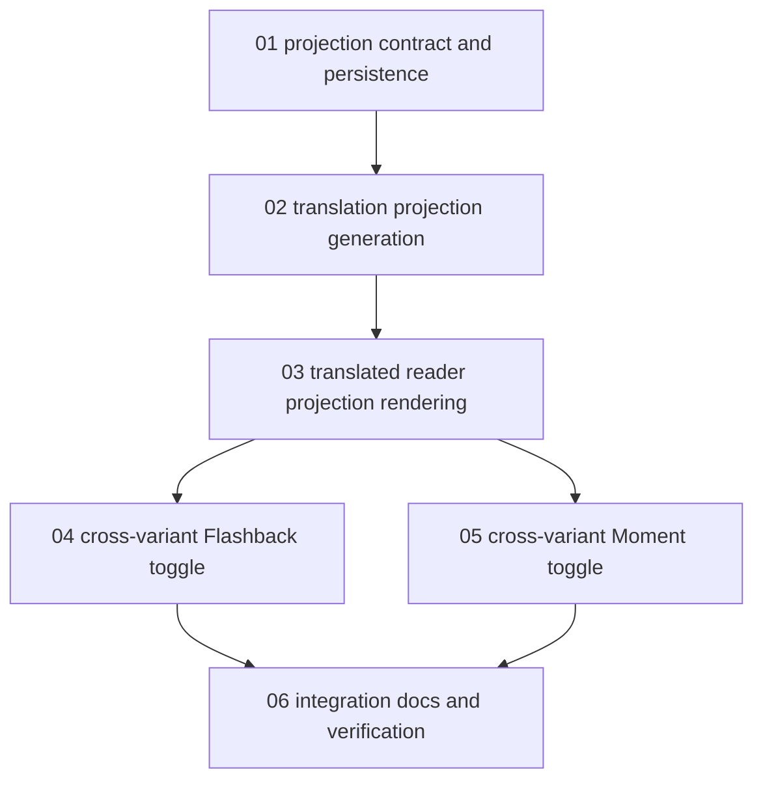

# Task 19V: Translated Reader Annotation Projection Implementation Plan

> **For agentic workers:** REQUIRED SUB-SKILL: Use superpowers:subagent-driven-development (recommended) or superpowers:executing-plans to implement this plan task-by-task. Steps use checkbox (`- [ ]`) syntax for tracking.

**Goal:** Let Flashbacks and Moments work from both source and translated reader variants while keeping source `CONTENT.md` metadata as the canonical state.

**Architecture:** Keep `flashbacks` and `moments` canonical by `memory_id`, not by translated language. Translation commit writes a durable projection map from source reader ranges to translated reader ranges. Reader load, Flashback toggle, and Moment toggle use that map to project canonical source metadata into the translated variant and to reverse-project translated selections back to source metadata.

**Tech Stack:** TypeScript, Bun, Vitest, Drizzle SQLite migrations, existing `markdown-it` reader renderer, existing `src/server/store/flashback-markers.ts` reader-text projection, Task 19U segment translation pipeline, SolidStart API routes and reader components.

---

## Execution Model

Task 19V is a correction workflow tied to Task 19. It must be executed after Task 19U's segment-based translation path is present because the projection map depends on segment ranges.

This plan is intentionally decomposed. Do not ask one worker to hold translation persistence, reader rendering, Flashback mutation, Moment mutation, and docs verification in one context.

Each subtask owns one domain:

- A clear role.
- A bounded file surface.
- A focused test command.
- A handoff contract for the next subtask.

The parent worker reviews each handoff before starting dependent subtasks.

## Current Behavior To Replace

- Source reader routes render canonical Flashbacks and allow Flashback/Moment creation.
- Translated reader routes load translated `CONTENT.md`, but do not render canonical Flashbacks and cannot safely create Flashbacks or Moments.
- `POST /api/flashbacks` resolves every selection against source `CONTENT.md`.
- `POST /api/moments` validates every section against source `CONTENT.md`.
- The translation pipeline commits translated `CONTENT.md` and then purges temporary chunk data, leaving no durable source-to-translation alignment data.

## Product Contract

- A Flashback created on source should render on translated content when its source range can be projected.
- A Flashback created on translated content should create or remove the same canonical source Flashback row after reverse projection.
- A Moment created on source should show active state on the translated section with the same section path.
- A Moment created on translated content should create or remove the same canonical source Moment row after reverse projection.
- Existing `flashbacks` and `moments` tables remain the canonical product state.
- Do not duplicate user annotations per language.
- Do not guess when the projection map is missing, stale, ambiguous, or too coarse for the selected range.

## Alignment Granularity Decision

Projection is deterministic at translation segment granularity. Task 19V must tighten segment extraction so prose text nodes are split into sentence-like alignment segments using `Intl.Segmenter` when available, with a small deterministic punctuation fallback only for environments without `Intl.Segmenter`.

Supported in this workflow:

- Full segment selections.
- Whole-sentence selections inside paragraphs.
- Unions of adjacent projected segments.
- Heading sections by `sectionPath`.

Out of scope for this workflow:

- Word-level cross-language alignment.
- Guessing a Japanese phrase for an arbitrary English substring inside one sentence.
- Calling Codex/OpenAI to align Flashback selections after translation.

If a selected range only partially overlaps one projection span, the server rejects the cross-variant toggle with a stable 409 response instead of expanding silently or marking the wrong text.

## Subtask Index

1. [Projection contract and persistence](task-19-codex-translation-reader-projections/01-projection-contract-and-persistence.md)
2. [Translation projection generation](task-19-codex-translation-reader-projections/02-translation-projection-generation.md)
3. [Translated reader projection rendering](task-19-codex-translation-reader-projections/03-translated-reader-projection-rendering.md)
4. [Cross-variant Flashback toggle](task-19-codex-translation-reader-projections/04-cross-variant-flashback-toggle.md)
5. [Cross-variant Moment toggle](task-19-codex-translation-reader-projections/05-cross-variant-moment-toggle.md)
6. [Integration docs and verification](task-19-codex-translation-reader-projections/06-integration-docs-and-verification.md)

## Dependency Graph

## Parallelization Rules

- `01` must run first.
- `02` depends on `01`.
- `03` depends on `02`.
- `04` and `05` can run in parallel after `03`.
- `06` runs last after both mutation paths are complete.

## Cross-Cutting Constraints

- Do not modify canonical `CONTENT.md` for normal Flashback or Moment persistence.
- Do not create language-specific canonical Flashback or Moment rows.
- Do not persist raw Codex request/response payloads in the projection table.
- Do not keep completed translated chunk Markdown in SQLite after final commit.
- Do not render stale projections when `source_hash` or `output_hash` differs.
- Do not let translated selections mutate source metadata unless reverse projection is exact at the configured alignment granularity.
- Keep browser-facing error messages safe and specific enough to distinguish missing projection from stale source and ambiguous selection.

## Final Acceptance Criteria

- Completing a new translation writes translated `CONTENT.md` plus a durable projection map.
- Completed chunk text remains purged after commit.
- Source Flashbacks render in translated reader variants when projection is current.
- Translated Flashback creation/removal mutates the canonical source `flashbacks` rows through exact reverse projection.
- Source Moments render active state in translated reader variants by projected section identity.
- Translated Moment creation/removal mutates canonical source `moments` rows.
- Missing, stale, ambiguous, or partial-span projections fail closed without guessed annotation placement.
- Focused server/component tests, typecheck, `git diff --check`, and full verification pass or document a confirmed unrelated existing flake.
